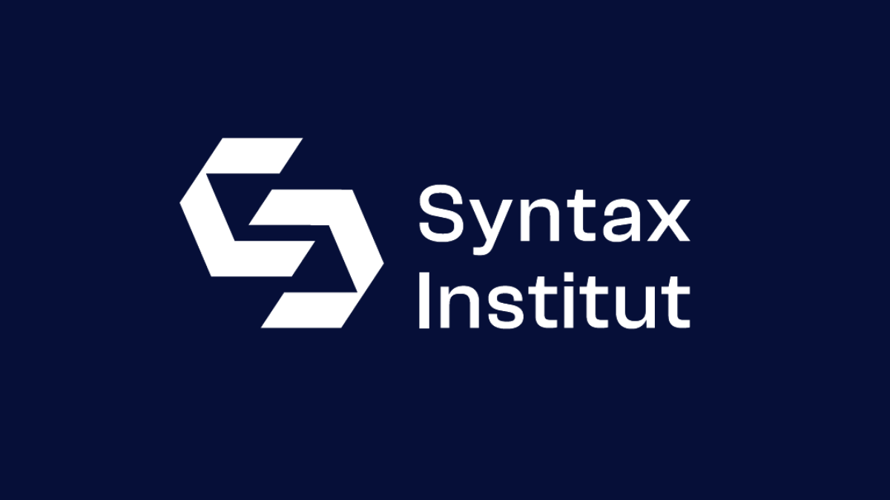

# Privileges: A Terminal-Based Game
## About the Game
Privileges is a terminal-based game designed to highlight societal inequalities and the uneven distribution of opportunities. The game provides insights into various life paths around the globe and explores the social prerequisites for good jobs, education, and secure living conditions. The goal is to foster empathy towards social minorities, encourage self-reflection on one's societal position, and stimulate a stance of solidarity.

The game challenges our understanding and delves into the complex dynamics of privilege. It includes a series of questions that players answer based on their real-life experiences or the experiences of a pre-defined character. The game tracks the player's progress based on their answers, providing a visual representation of the privileges (or lack thereof) they may experience in their life.

## Installation
To start the game, run the main.kt file located in the src/main/ directory.

## Game Structure and Flow
The game starts with an onboarding process where players choose the language they want to play the game in. The game currently supports only German, but you're encouraged to contribute and help in expanding to other languages.

Players are presented with a choice to play as themselves or to choose one of the pre-made characters. If they choose to play as themselves, they are encouraged to answer the questions as honestly as possible. If they choose a pre-made character, they are asked to immerse themselves in the role as much as possible and answer the questions based on that role.

The main part of the game consists of a series of questions. For each question, players can answer with 'yes' or 'no'. For each question answered with 'yes', the game advances the player one step forward - for one answered with 'no', the game moves the player a step back.

At the end of the game, players are presented with an evaluation of their answers and are encouraged to reflect on their experiences.

## Customization and Further Development
The game is designed to be customizable and extendable. The questions can be adjusted to fit different contexts, and more languages can be added to make the game more accessible to a broader audience. You're encouraged to contribute to its development.

## License
This project is open source under the MIT license. This means you are free to use, copy, modify, merge, publish, distribute, sublicense, and/or sell copies of the software, provided you include the appropriate copyright notice and disclaimers.

## Contact
For any queries or suggestions, you can reach out through GitHub or visit https://www.borisniehaus.de for other ways of reaching out.

## Contributing
Contributions are welcome! Feel free to submit a pull request or open an issue on GitHub.

## Sources
Many different sources have been used. For example:

- ROLLENSPIEL: „EINEN SCHRITT NACH VORN“ by handicap-international.de
- „abgehängt“ – Ein Privilegienspiel by bne-sachsen.de/

## Disclaimer
I've been working on this repository for my "Mobile App Development" course at Syntax Institute. It's a terminal-based program that I developed as part of my capstone project for the "Fundamentals of Programming" module (M2).

I've written the program in Kotlin, using IntelliJ as IDE. This project gave me the opportunity to apply the concepts I learned in the course, including:

Loops: Loops are used throughout this code. A while loop is used in the main.kt file, prompting the game to restart if the user decides to play again. Another one is used in the askForUserName() function to ensure the entered name is shorter than 10 characters. In the onboarding2_de() function, a form of recursion serves as a loop, prompting the user to make a valid character choice.

Classes: Classes are used in this code to model different things. For example, there's a class in Roles_DE.kt that models role cards for players. Each role card has a name, age, origin, fate, and gender.

Functions: The code uses various functions to carry out specific tasks. For instance, the game1deu() function goes through shuffled questions and facts, guiding the player through each question and keeping track of their answers. It uses a loop to ensure that the input received is valid and updates player's position based on their responses. The printProgressBar() function is an example of a visual aid, as it produces a progress bar on the terminal which updates as the player progresses through the game. It represents the player's progress with filled and unfilled sections, dynamically changing based on the player's answers. Other utility functions include wordWrap(), which is used to wrap text to fit within a specific width, and variable definitions like userName, yesCount, and noCount keep track of user's name and their game progress.

These are the Slides used for my presentation
[.pdf here](https://github.com/just1984/Privileges_V2/blob/main/img/Presentation/Presentation_M2.pdf)

